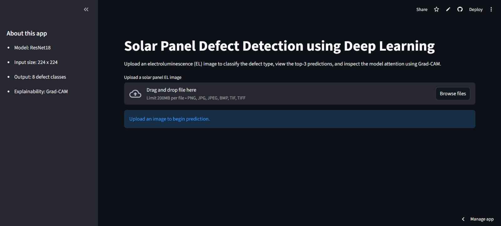
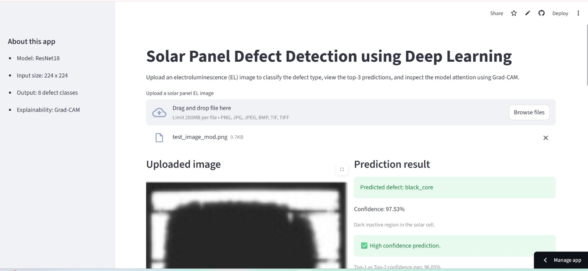
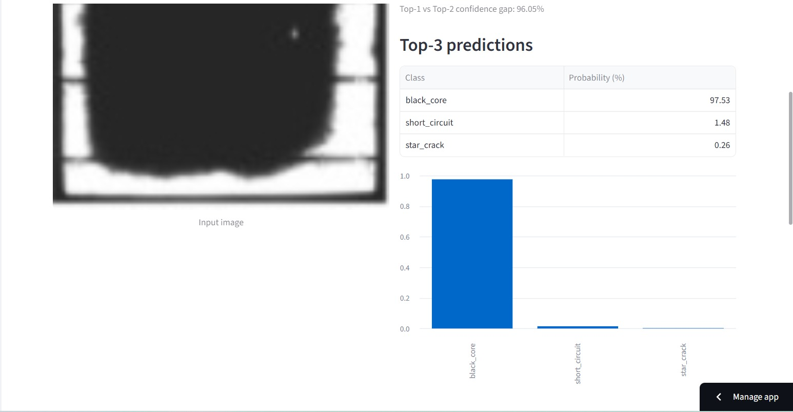
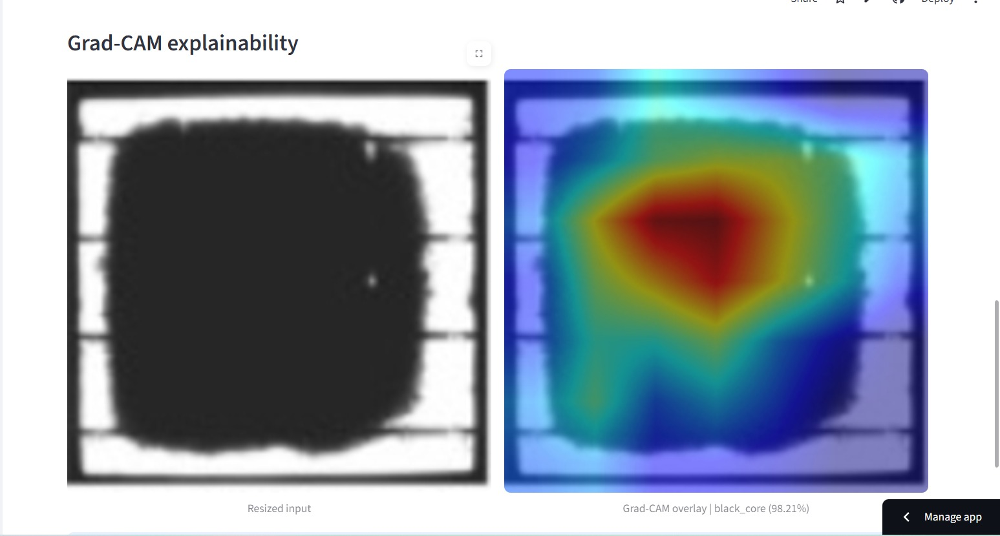

# Solar Panel Defect Detection using Deep Learning

A deep learning-based web application for detecting solar panel defects from Electroluminescence (EL) images using a ResNet18 model. The app provides top-3 predictions, confidence interpretation, and Grad-CAM explainability.

## Live App
[Open Streamlit App](https://solar-defect-detection-esppqh7f9n8mxaqw6ysxmz.streamlit.app)

## Features
- ResNet18-based defect classification
- Top-3 prediction probabilities
- Confidence interpretation logic
- Grad-CAM explainability
- Interactive Streamlit interface
- Cloud deployment via Streamlit Community Cloud

## Project Structure

app.py
model_utils.py
app_config.py
requirements.txt
packages.txt
solar_defect_model_final.pth
README.md 
assets/

## Model Details

**Architecture:** ResNet18  
**Input size:** 224 × 224  
**Output:** 8 defect classes  
**Explainability:** Grad-CAM  

## Tech Stack

- Python
- PyTorch
- Torchvision
- Streamlit
- Grad-CAM
- OpenCV
- NumPy
- Pandas
- Matplotlib

## Defect Classes

The model classifies the following defect types:

- Crack
- Finger interruption
- Thick line
- Star crack
- Inactive cell
- Dark area
- Corrosion
- No defect

## How the App Works

1. Upload EL image  
2. Image preprocessing (resize + normalization)  
3. Model prediction  
4. Top-3 probability calculation  
5. Confidence interpretation  
6. Grad-CAM visualization  

## Confidence Interpretation Logic

### High confidence

- Confidence > 70%
- Gap between top-1 and top-2 > 10%

### Uncertain prediction

- Confidence < 70%
- OR small probability gap between classes

### Low confidence

- Confidence < 50%

## How to Run Locally

### Clone repository

git clone https://github.com/Er-Pr9/solar-defect-detection.git
cd solar-defect-detection

## How to Run Locally

pip install -r requirements.txt

## Run application

streamlit run app.py

## Deployment

The application is deployed using:

GitHub → Streamlit Community Cloud → Automatic CI deployment

The app automatically redeploys when new commits are pushed to the repository.

## Example Workflow

1. Upload solar EL image  
2. Model predicts defect class  
3. Confidence score displayed  
4. Top-3 classes shown  
5. Grad-CAM highlights defect region  

## Key Learning Outcomes

- Deep learning model deployment
- Explainable AI implementation
- Streamlit web application development
- Cloud debugging and dependency resolution
- Production-style ML packaging
- GitHub deployment workflow

## Future Improvements

Planned enhancements:

- Model comparison (ResNet50 / EfficientNet)
- Confusion matrix visualization
- Batch image testing
- Prediction report download
- REST API version
- Accuracy metrics dashboard

## Screenshots

### App Interface

### Prediction Output

### Grad-CAM Visualization

## Resume Project Description

**Solar Panel Defect Detection using Deep Learning**

- Developed ResNet18 based defect classifier for EL solar images
- Implemented top-3 prediction analysis and confidence interpretation logic
- Integrated Grad-CAM for explainable AI visualization
- Built interactive Streamlit web application for defect classification
- Deployed using GitHub and Streamlit Community Cloud

## Author

**Pranav Jichkar**

## License

This project is intended for educational and research purposes only.